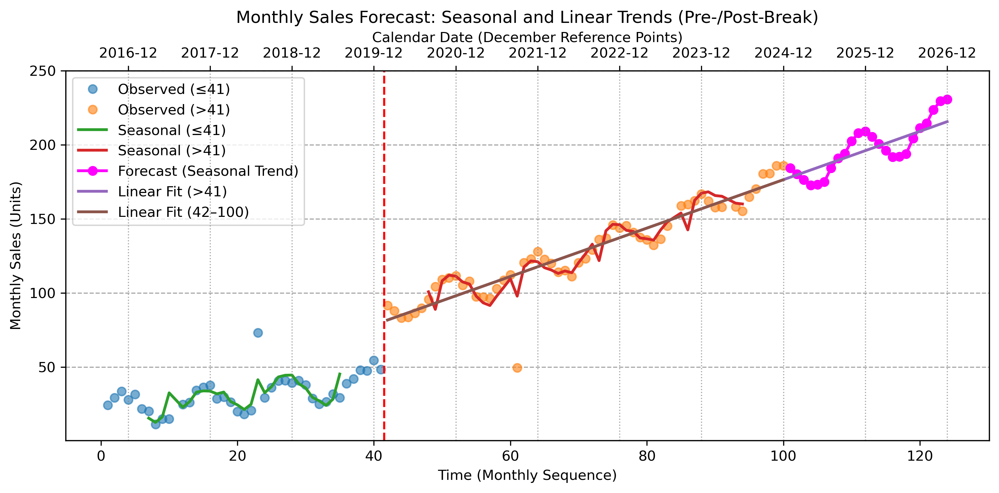
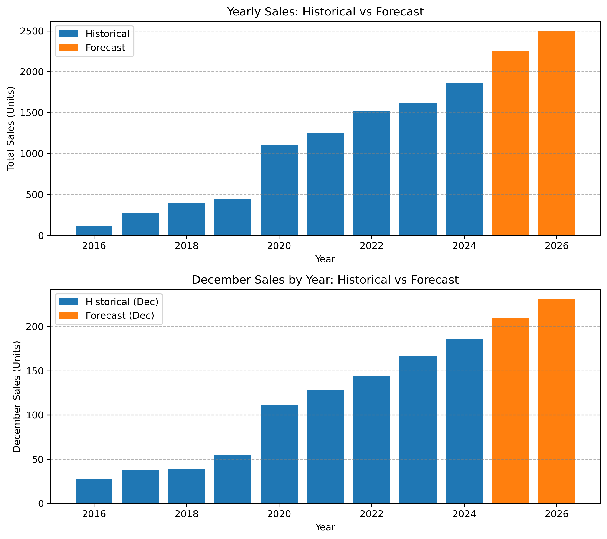
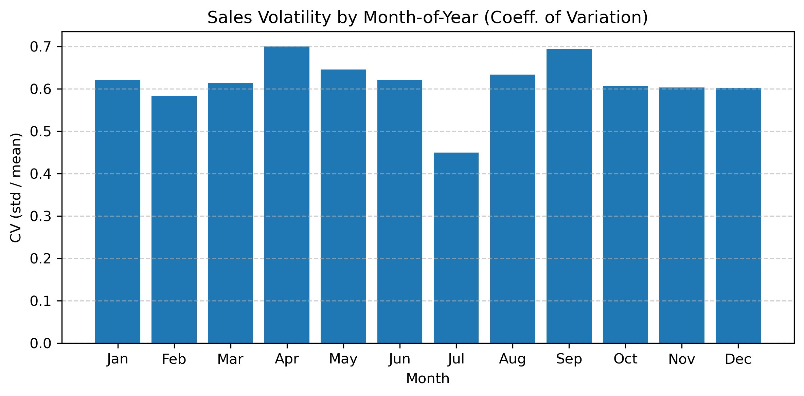

# 🛍️ Retail Sales Forecasting Demo

## 📘 Project Overview

A concise, end-to-end demonstration of **retail sales forecasting** using **Python**.  

This project illustrates a practical workflow for analyzing historical retail data, fitting **linear regression** and **seasonal decomposition** models, and generating interpretable forecasts for future periods (**2025–2026**).

It is designed as a lightweight, interpretable template for real-world **demand prediction** and **trend analysis** tasks.

---

## ⚙️ Workflow Summary

### **Step 1 – Load Raw Sales Data**
- Load the CSV file containing historical monthly sales.
- Review dataset structure and basic statistics.
- Visualize the raw sales trend over time.

### **Step 2 – Data Pre-Processing**
- Remove months with zero or outlier sales values.  
- Define **September 2016** as the starting point of the series, assuming **December** represents the annual peak month.
- Identify a clear structural jump in sales around **February 2020**, likely corresponding to a **store remodel or space expansion**.

### **Step 3 – Model Fitting**
- Fit both **linear** and **seasonal** functions on the full dataset.  
- Split the data into **pre-** and **post-break** segments to capture distinct growth patterns.

### **Step 4 – Forecast Generation**
- Train forecasting models (linear regression and seasonal decomposition) using data from **2020-Feb to 2024-Dec**.  
- Generate **iterative multi-period forecasts** through **December 2026**.

### **Step 5 – Statistical Sales Summary**
- Compute **monthly and yearly sales growth rates**.
- Estimate **predicted growth for 2025–2026**.
- Compare **historical vs. forecasted** December and annual sales.
- Summarize additional insights such as average monthly sales and sales volatility.

---

## 📊 Key Results and Visualizations

**1. Overall Forecasting Trend**  
Illustrates historical and forecasted sales with both linear and seasonal fits.  
Highlights the 2020 break point and forecast extension through 2026.

**2. Yearly and December Sales Comparison**  
Displays total yearly sales and December-only sales (historical vs. forecast) in side-by-side bar plots.

**Figure 3. Sales Volatility by Month**  
Shows month-to-month variability in sales, highlighting stable and high-fluctuation periods that help evaluate forecast confidence.  

---

## 🧠 Insights and Conclusions

- Sales growth accelerated noticeably after **February 2020**, suggesting a possible **remodeling or capacity increase inferred from the data**.  
- Forecasts indicate continued moderate growth through **2026**, with strong **December seasonality** each year.  
- Post-2020 model results provide a more accurate view of future performance than models trained on the full pre-2020 dataset.  
- The approach can be generalized to other retail datasets w

---

## 🧰 Tech Stack

- **Python 3**
- **pandas**, **NumPy**, **matplotlib**
- **scikit-learn** (Linear Regression, MLPRegressor)
- **Jupyter Notebook**

---